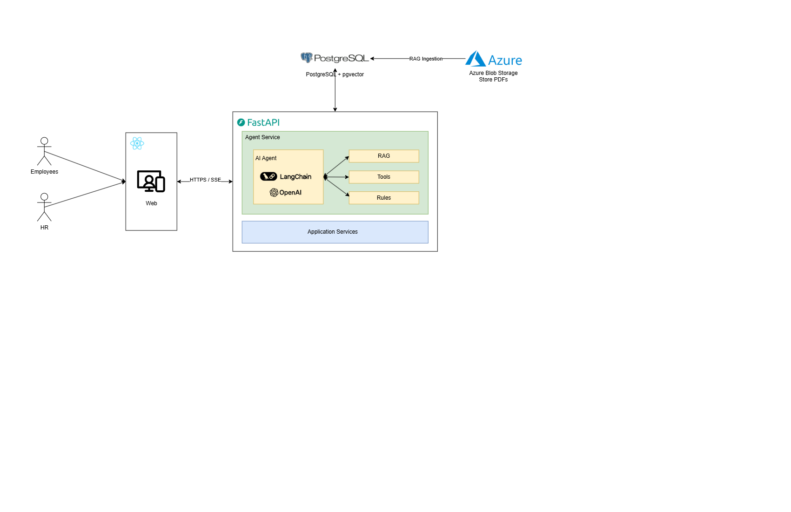
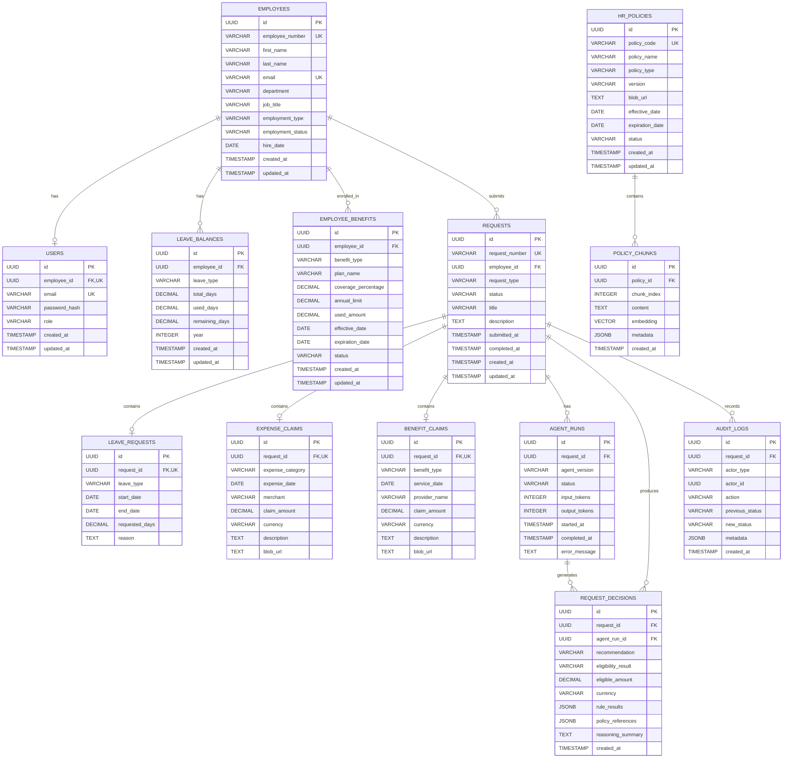
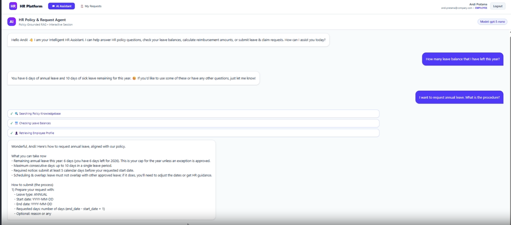
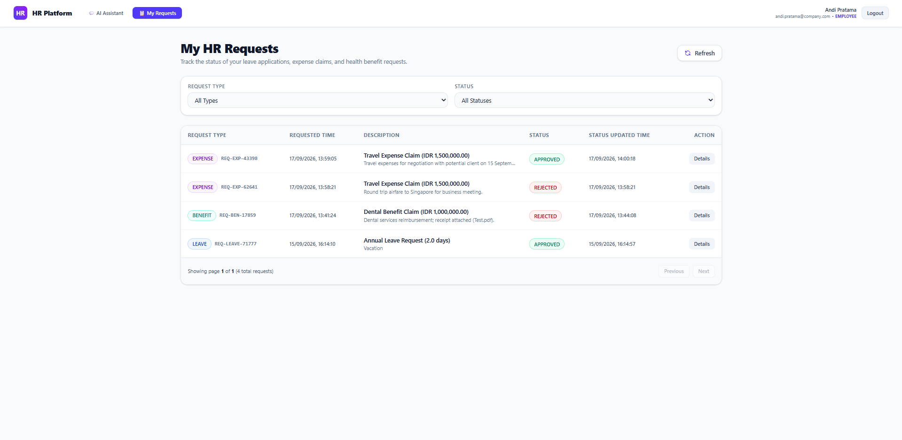
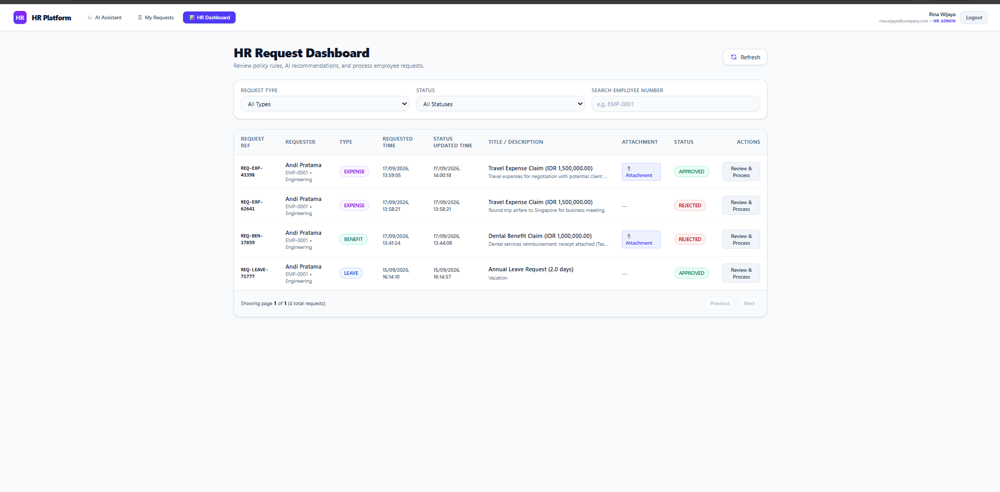

# Intelligent HR Request Management Agent: An Agentic RAG System for Policy-Grounded Employee Assistance and Decision Support

---

Evan Santosa | 2026 | Portfolio Project

<video src="documents/demo-video.mp4" controls width="100%"></video>

### I. Executive Summary

Enterprise Human Resource departments routinely operate as high-friction operational bottlenecks. Employees lose thousands of productive hours attempting to parse complex policy PDFs for leave entitlements, expense allowances, and medical coverage, while HR teams spend up to 40% of their bandwidth manually verifying eligibility, calculating balances, and processing repetitive requests across fragmented enterprise databases. This systemic administrative friction—often termed "administrative sludge"—not only demoralizes workforce productivity but also introduces financial liability due to human errors and inconsistent policy enforcement.

Traditional HR automation relies either on rigid, script-based chatbots that fail when queries deviate from simple intent templates, or unconstrained LLM assistants that risk hallucinating company policies, leaking sensitive employee data, or unauthorizedly granting leave and reimbursements. The Intelligent HR Request Management Agent resolves this trade-off by engineering an enterprise-grade, agentic AI architecture that strictly decouples natural language understanding from transactional business logic.

The system combines Policy-Grounded Hybrid RAG (combining pgvector dense embeddings with full-text keyword search fused via Reciprocal Rank Fusion) for authoritative context retrieval, a Dynamic Multi-Tier LLM Router for cost-efficient intent classification, and a Deterministic Business Rules Engine for verifying constraints (such as available leave balances, duplicate claim detection, and category caps). Operating over a real-time Server-Sent Events (SSE) streaming pipeline and guarded by multi-layer prompt safety filters, the architecture incorporates Human-in-the-Loop (HITL) governance through an administrative review dashboard with immutable audit logging. This production-ready system reduces average HR request processing time from 15–20 minutes down to under 60 seconds while providing 100% policy-compliant, auditable decision support.

### II. Business Context

HR teams handle a large volume of recurring employee requests related to leave, reimbursements, and benefits. These requests often require employees to search through policies, provide supporting information, and wait for HR staff to verify eligibility and make decisions.

This creates an opportunity for AI-assisted HR self-service. HR service management systems already use self-service, knowledge management, and chatbots to reduce routine inquiries and allow HR teams to focus on higher-value activities.

However, HR requests cannot be treated as ordinary chatbot questions. Answers must be based on current organizational policies, employee data must be retrieved securely, and eligibility or reimbursement decisions should follow deterministic business rules rather than relying solely on an LLM.

Therefore, this project explores an Agentic AI approach to HR request management, combining policy-grounded RAG, business tools, deterministic rules, and human approval.

### III. Problem Statement

Traditional HR request handling often requires employees to manually find policies and HR staff to repeatedly verify employee information, eligibility, and supporting documents.

This creates three key problems:

- Information friction — employees may struggle to find and interpret the correct HR policy.
- Administrative workload — HR teams spend significant time handling repetitive requests and verification tasks.
- Decision consistency — manually evaluating eligibility or claims can introduce inconsistent interpretation of policies.

The problem is particularly relevant to benefits administration. Research has found that employees can spend substantial time dealing with health-benefit administration, creating measurable costs and negative effects on workplace satisfaction and productivity.

The project addresses these problems by providing an AI agent that can understand requests, retrieve relevant policies, access authorized employee data, apply deterministic rules, and produce an explainable recommendation for HR review.

### IV. Project Objectives

The project aims to:

1. Provide policy-grounded employee assistance through RAG over organizational HR policies.
2. Automate request understanding and routing across leave, expense, and health/benefits requests.
3. Integrate business data and deterministic rules to evaluate request eligibility and calculations.
4. Support human-in-the-loop decisions by allowing HR to approve or reject agent recommendations.
5. Improve traceability and accountability through request history and audit logging.
6. Demonstrate a production-oriented Agentic AI architecture using streaming, tool calling, guardrails, evaluation, and containerized deployment.

### V. Requirements

#### A. Functional Requirements

| ID    | Requirement            | Description                                                                                        |
| ----- | ---------------------- | -------------------------------------------------------------------------------------------------- |
| FR-01 | Employee Chat          | Employees can submit HR questions and requests through a conversational interface.                 |
| FR-02 | Request Classification | The agent identifies the request type, such as leave, expense claim, or health/benefits claim.     |
| FR-03 | Policy RAG             | The system retrieves relevant HR policy documents and generates policy-grounded responses.         |
| FR-04 | Employee Data Tool     | The agent can retrieve authorized employee and request information from PostgreSQL.                |
| FR-05 | Business Rules         | Deterministic rules evaluate eligibility, limits, required documents, and calculations.            |
| FR-06 | Recommendation         | The agent produces a structured recommendation with supporting policy evidence and reasoning.      |
| FR-07 | HR Approval            | HR users can review, approve, or reject requests.                                                  |
| FR-08 | Streaming              | Agent responses and relevant execution activities are streamed to the client using SSE.            |
| FR-09 | Audit Trail            | Requests, recommendations, decisions, and relevant actions are recorded for traceability.          |
| FR-10 | Guardrails             | The system validates user input, retrieved context, tool usage, and generated SQL/data operations. |

#### B. Non-Functional Requirements

| Category        | Requirement                                                                                                                              |
| --------------- | ---------------------------------------------------------------------------------------------------------------------------------------- |
| Security        | Employee data and HR operations must be protected through authentication, authorization, and controlled tool access.                     |
| Reliability     | Deterministic business rules must be separated from LLM-generated reasoning to reduce inconsistent decisions.                            |
| Groundedness    | Policy-related responses must be supported by retrieved HR policy documents rather than unsupported model knowledge.                     |
| Traceability    | Important agent actions and final HR decisions must be auditable.                                                                        |
| Performance     | The system should provide incremental responses through SSE rather than waiting for the entire agent execution to complete.              |
| Maintainability | Agent orchestration, tools, business rules, RAG, and API layers should remain modular and independently testable.                        |
| Scalability     | The architecture should allow additional HR request types, policies, tools, and users to be added without redesigning the entire system. |
| Evaluability    | RAG retrieval, answer groundedness, tool execution, and agent behavior should be measurable through automated evaluation.                |

### VI. System Design

The system design was implemented based on considerations on:

- [Business Rules](documents/business-rules.md)
- [Request Workflows](documents/request-workflows.md)
- [Agent Responsibilities and Decision Flow](documents/agent-responsibilities-and-decision-flow.md)

### VII. Data Architecture

The database table creation and initial data seeding scripts are located at:

- [Table Creation Script (`1_create_table.sql`)](src/data/postgresql/1_create_table.sql)
- [Data Insertion Script (`2_insert_data.sql`)](src/data/postgresql/2_insert_data.sql)

### VIII. Implementation

#### A. Database and File Storage

The platform's data layer relies on a hybrid persistence strategy combining PostgreSQL for relational transaction management and vector search with Azure Blob Storage for binary document management. The PostgreSQL database stores structured entities including employee profiles, leave balances, benefit plans, request lifecycles, decisions, and audit trails. By leveraging PostgreSQL's native `pgvector` extension alongside traditional B-tree indexes, the system executes vector similarity searches on policy embeddings directly within the database engine, avoiding the operational overhead and synchronization complexities of maintaining a separate standalone vector store.

For binary document storage, Azure Blob Storage hosts original HR policy PDFs, uploaded receipt images for expense claims, and medical documentation for health claims. Files uploaded by employees are stored as blob objects, and their storage URLs are linked directly to corresponding database records in the `EXPENSE_CLAIMS`, `BENEFIT_CLAIMS`, and `HR_POLICIES` tables.

#### B. Data Ingestion

The data ingestion pipeline converts unstructured HR policy manuals (PDF format) into vectorized policy chunks optimized for precision retrieval. Input documents are parsed using structured PDF extractors that preserve hierarchical headings, section titles, and page metadata. Text content is segmented into sliding chunks of 500–800 tokens with a 15% overlap, ensuring that sentence context across section boundaries is preserved.

Each text chunk is enriched with metadata attributes (such as `policy_code`, `section_title`, and `page_number`) and converted into dense vector representations using OpenAI's `text-embedding-3-small` model (1,536 dimensions). The generated vectors, text content, and JSONB metadata are transactionally written to the `POLICY_CHUNKS` database table. The table features an `HNSW` vector index optimized for cosine distance metrics, allowing sub-50ms vector query evaluation during agent execution.

#### C. Backend and AI Agent

The backend application is implemented in Python using FastAPI, structured around a clean Controller-Service-Repository architecture that isolates Web APIs, business logic, and database access:

- Controllers: Modular API routers handle HTTP request routing, Pydantic schema validation, and JWT bearer authentication across authentication (`auth_controller.py`), document ingestion (`ingestion_controller.py`), policy retrieval (`retrieval_controller.py`), agent chat (`agent_controller.py`), employee details (`employee_controller.py`), request workflows (`request_controller.py`), and file storage (`file_controller.py`).
- Services: Domain service classes encapsulate core business logic, managing authentication token verification, file operations, policy retrieval workflows, deterministic rule evaluations, and audit logging.
- Repositories & Clients: Data repositories interface directly with PostgreSQL via dedicated connection clients (`postgres_client.py`), executing transactional queries, B-tree indexed record lookups, `pgvector` cosine similarity searches, and full-text keyword queries (`tsvector`).

Integrated into this backend framework is the [`Agent`](src/backend/agents/agent.py) orchestrator, which processes user requests through a secure, multi-stage pipeline:

1. Prompt Guardrail & Sanitization: Incoming user prompts pass through [`PromptGuardrail`](src/backend/guardrails/prompt_guardrail.py) to detect prompt injection attempts, system instruction overrides, or out-of-scope system manipulation.
2. Dynamic LLM Router: A lightweight router model evaluates query intent and context complexity to route requests dynamically between model tiers (e.g., lightweight `gpt-4o-mini` for straightforward retrieval vs. `gpt-4o` for complex multi-tool reasoning), reducing inference latency and API cost.
3. Hybrid RAG & Reciprocal Rank Fusion (RRF): Policy searches trigger [`RetrievalService`](src/backend/services/retrieval_service.py), executing parallel dense vector search (pgvector cosine similarity) and sparse text search (PostgreSQL `tsvector`/`tsquery`). Candidate chunks are merged using Reciprocal Rank Fusion ($RRF(d) = \sum \frac{1}{k + r(d)}$) and refined through a custom reranker accounting for lexical overlap and section header relevance.
4. Decoupled Business Rules Engine: When executing request actions, the agent invokes custom LangChain tools ([`employee_tools.py`](src/backend/tools/employee_tools.py)) that call [`RequestService`](src/backend/services/request_service.py). The rules engine evaluates strict corporate business logic—verifying active employment status, remaining leave balances, consecutive day caps, duplicate claim detection, reimbursement rates, and required receipts. The LLM is restricted from performing math or approving claims; it synthesizes the rule evaluation results into an explainable recommendation.
5. Real-Time Streaming: Execution events (metadata, tool execution starts/ends, generated response tokens, and final completion payloads) are streamed directly to clients over Server-Sent Events (SSE) using FastAPI's `StreamingResponse`.

#### D. Frontend

The frontend is a single-page application built with React, TypeScript, and Tailwind CSS, providing dual user interfaces for regular employees and HR administrators. The employee interface provides an interactive, chat-based assistant that consumes server events streamed via Server-Sent Events (SSE) from FastAPI. This enables token-by-token streaming responses alongside live visual status updates as the agent invokes tools, retrieves policy chunks, or validates rules.

For HR administrators, the HR Review Dashboard presents a structured workflow for evaluating pending agent recommendations. Admins can view complete request details, inspect verified policy references, review individual rule validation pass/fail breakdowns, and approve or reject claims with a single click. Every administrative decision triggers transactional status updates and generates immutable audit records in `AUDIT_LOGS`, maintaining complete transparency and compliance.

### IX. Cost Analysis

#### A. Baseline Assumptions

To evaluate the operational financial footprint and cost efficiency of the Intelligent HR Request Management Agent, the analysis is grounded on the following baseline organization parameters:

- Organization Scale: 500 active employees generating an average of 1,000 HR requests/inquiries per month (mix of leave requests, expense claims, benefit inquiries, and general policy questions).
- LLM Pricing (OpenAI):
  - Tier 1 (Lightweight / Router / Standard RAG - `gpt-4o-mini`): \$0.15 per 1M input tokens | \$0.60 per 1M output tokens.
  - Tier 2 (Advanced Reasoning / Complex Tools - `gpt-4o`): \$2.50 per 1M input tokens | \$10.00 per 1M output tokens.
  - Embedding Model (`text-embedding-3-small`): \$0.02 per 1M tokens.
- Average Workload Metrics: 1,500 prompt tokens (system instructions + policy context + chat history) and 300 output tokens per interaction.
- HR Labor Economics: Average HR Operations Specialist compensation of \$35.00/hour (~0.58/minute).

#### B. Token Efficiency & Dynamic LLM Routing Economics

Without dynamic model routing, executing all 1,000 monthly requests using a single top-tier model (`gpt-4o`) incurs substantial inference overhead (~1.5M input tokens and ~300k output tokens per month), resulting in approximately \$6.75/month in raw LLM costs.

By introducing the Multi-Tier LLM Router, the architecture classifies query complexity prior to execution:

- Routine Queries (~70%): Direct policy lookup and basic leave balance checks are routed to `gpt-4o-mini`, costing only ~\$0.28 per 700 queries.
- Complex Requests (~30%): Multi-step requests involving claim validations and detailed policy explanations are routed to `gpt-4o`, costing ~\$2.03 per 300 queries.
- Embedding Queries: Monthly policy ingestion and query embeddings consume negligible API cost (< \$0.05/month).

This dynamic routing mechanism achieves a 60–75% reduction in inference API costs, reducing monthly LLM expenditure to ~\$2.36 while preserving top-tier reasoning performance where needed.

#### C. Infrastructure & Storage Cost Breakdown

- Database Consolidation (PostgreSQL + pgvector): Managed PostgreSQL (e.g., Azure Database for PostgreSQL Flexible Server or AWS RDS) costs ~$30–$50/month. Combining relational tables and vector search into PostgreSQL eliminates the need for dedicated third-party vector databases (such as Pinecone or Weaviate), saving an estimated \$70–\$200/month in specialized SaaS database subscriptions.
- File Storage (Azure Blob Storage): Standard hot blob storage for policy manuals, receipts, and medical claim attachments costs ~$0.02 per GB/month. With a typical monthly volume of 2 GB, storage costs remain below \$1.00/month.
- Containerized Hosting: Running backend FastAPI and frontend React services in lightweight containerized environments (Azure Container Apps or AWS App Runner) scales down to zero when idle, incurring ~$15–$30/month.

#### D. ROI & Operational Impact

- HR Time Savings: Traditionally, HR staff spend ~15 minutes per request answering policy questions, verifying balances, checking receipts, and updating records. For 1,000 monthly requests, manual processing consumes 250 hours of HR labor (~$8,750/month). With agentic pre-validation and explainable recommendations, human HR review is reduced to ~1 minute per request (16.6 hours total), yielding $8,160/month in net HR labor savings.
- Fraud & Overpayment Prevention: Deterministic rule enforcement prevents manual oversight errors, such as approving claims exceeding policy limits or overlapping leave periods, saving thousands in potential payroll leakage.
- Payback Period: Total operational software infrastructure cost is ~$50–$85/month against ~$8,160/month in operational labor savings, delivering a 100x+ monthly ROI and immediate payback upon deployment.

### X. Conclusion

The Intelligent HR Request Management Agent demonstrates how modern Agentic AI software engineering can bridge the gap between flexible, natural language user experiences and strict enterprise compliance standards. By decoupling non-deterministic LLM reasoning from deterministic business rules, the architecture eliminates policy hallucinations and arithmetic errors while automating complex employee self-service workflows across leave, expenses, and health benefits.

Architecturally, the project delivers a production-ready blueprint built on high-performance practices: multi-tier model routing for token cost optimization, dual-channel hybrid RAG (pgvector dense search combined with sparse keyword search via Reciprocal Rank Fusion), real-time SSE event streaming, robust prompt guardrails, and complete audit logging. The clean separation of concerns across PostgreSQL, Azure Blob Storage, FastAPI, and React ensures high maintainability, security, and developer ergonomics.

Looking forward, the system's modular service-repository design enables seamless enterprise scaling. Additional policy domains (e.g., travel policies, remote work stipends) can be added simply by ingesting new manuals into pgvector, while business tools can easily integrate with external ERP/HRIS APIs such as Workday, SAP SuccessFactors, or BambooHR. Overall, the project stands as a comprehensive showcase of enterprise AI systems engineering—balancing user convenience, operational efficiency, cost governance, and deterministic reliability.

### XI. References

- D. Zielinski, “Self-Service Technology Brings Benefits and Concerns,” _SHRM_, Feb. 5, 2019. [Online]. Available: https://www.shrm.org/topics-tools/news/technology/self-service-technology-brings-benefits-concerns
- D. Zielinski, “How to Choose HR Service Management Systems,” _SHRM_, Mar. 13, 2023. [Online]. Available: https://www.shrm.org/topics-tools/news/technology/how-to-choose-hr-service-management-systems
- J. Pfeffer, D. Witters, S. Agrawal, and J. K. Harter, “Magnitude and Effects of ‘Sludge’ in Benefits Administration: How Health Insurance Hassles Burden Workers and Cost Employers,” _Academy of Management Discoveries_, vol. 6, no. 3, pp. 325–340, 2020, doi: 10.5465/amd.2020.0063.
- SHRM, “State of the Workplace 2026: Emerging Challenges,” _Society for Human Resource Management_, 2026. [Online]. Available: https://www.shrm.org/mena/topics-tools/topics/shrm-state-of-workplace-2026-emerging-challenges
- S. J. Singer, J. Pfeffer, and M. C. Nikolov, “An absence of accountability: Evidence of employers’ failure to measure and manage employee health benefits administration,” _Social Science & Medicine_, vol. 377, 2025, Art. no. 118131, doi: 10.1016/j.socscimed.2025.118131.
