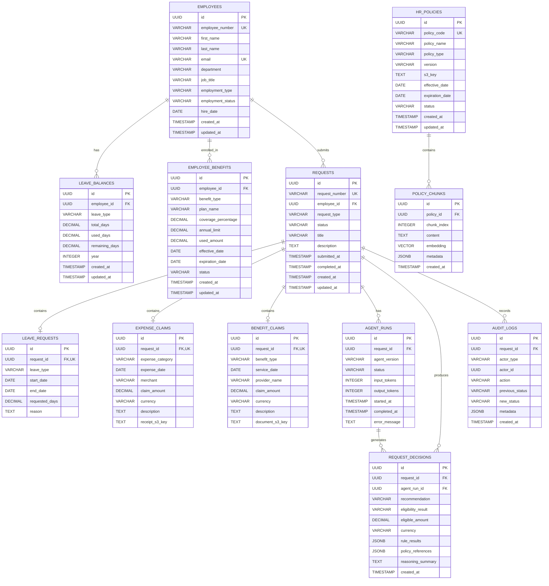

# Intelligent HR Request Management Agent: An Agentic RAG System for Policy-Grounded Employee Assistance and Decision Support

---

Evan Santosa | 2026 | Portfolio Project

### I. Executive Summary

### II. Business Context

HR teams handle a large volume of recurring employee requests related to leave, reimbursements, and benefits. These requests often require employees to search through policies, provide supporting information, and wait for HR staff to verify eligibility and make decisions.

This creates an opportunity for AI-assisted HR self-service. HR service management systems already use self-service, knowledge management, and chatbots to reduce routine inquiries and allow HR teams to focus on higher-value activities.

However, HR requests cannot be treated as ordinary chatbot questions. Answers must be based on current organizational policies, employee data must be retrieved securely, and eligibility or reimbursement decisions should follow deterministic business rules rather than relying solely on an LLM.

Therefore, this project explores an Agentic AI approach to HR request management, combining policy-grounded RAG, business tools, deterministic rules, and human approval.

### III. Problem Statement

Traditional HR request handling often requires employees to manually find policies and HR staff to repeatedly verify employee information, eligibility, and supporting documents.

This creates three key problems:

- Information friction — employees may struggle to find and interpret the correct HR policy.
- Administrative workload — HR teams spend significant time handling repetitive requests and verification tasks.
- Decision consistency — manually evaluating eligibility or claims can introduce inconsistent interpretation of policies.

The problem is particularly relevant to benefits administration. Research has found that employees can spend substantial time dealing with health-benefit administration, creating measurable costs and negative effects on workplace satisfaction and productivity.

The project addresses these problems by providing an AI agent that can understand requests, retrieve relevant policies, access authorized employee data, apply deterministic rules, and produce an explainable recommendation for HR review.

### IV. Project Objectives

The project aims to:

1. Provide policy-grounded employee assistance through RAG over organizational HR policies.
2. Automate request understanding and routing across leave, expense, and health/benefits requests.
3. Integrate business data and deterministic rules to evaluate request eligibility and calculations.
4. Support human-in-the-loop decisions by allowing HR to approve or reject agent recommendations.
5. Improve traceability and accountability through request history and audit logging.
6. Demonstrate a production-oriented Agentic AI architecture using streaming, tool calling, guardrails, evaluation, and containerized deployment.

### V. Requirements

#### A. Functional Requirements

| ID    | Requirement            | Description                                                                                        |
| ----- | ---------------------- | -------------------------------------------------------------------------------------------------- |
| FR-01 | Employee Chat          | Employees can submit HR questions and requests through a conversational interface.                 |
| FR-02 | Request Classification | The agent identifies the request type, such as leave, expense claim, or health/benefits claim.     |
| FR-03 | Policy RAG             | The system retrieves relevant HR policy documents and generates policy-grounded responses.         |
| FR-04 | Employee Data Tool     | The agent can retrieve authorized employee and request information from PostgreSQL.                |
| FR-05 | Business Rules         | Deterministic rules evaluate eligibility, limits, required documents, and calculations.            |
| FR-06 | Recommendation         | The agent produces a structured recommendation with supporting policy evidence and reasoning.      |
| FR-07 | HR Approval            | HR users can review, approve, or reject requests.                                                  |
| FR-08 | Streaming              | Agent responses and relevant execution activities are streamed to the client using SSE.            |
| FR-09 | Audit Trail            | Requests, recommendations, decisions, and relevant actions are recorded for traceability.          |
| FR-10 | Guardrails             | The system validates user input, retrieved context, tool usage, and generated SQL/data operations. |

#### B. Non-Functional Requirements

| Category        | Requirement                                                                                                                              |
| --------------- | ---------------------------------------------------------------------------------------------------------------------------------------- |
| Security        | Employee data and HR operations must be protected through authentication, authorization, and controlled tool access.                     |
| Reliability     | Deterministic business rules must be separated from LLM-generated reasoning to reduce inconsistent decisions.                            |
| Groundedness    | Policy-related responses must be supported by retrieved HR policy documents rather than unsupported model knowledge.                     |
| Traceability    | Important agent actions and final HR decisions must be auditable.                                                                        |
| Performance     | The system should provide incremental responses through SSE rather than waiting for the entire agent execution to complete.              |
| Maintainability | Agent orchestration, tools, business rules, RAG, and API layers should remain modular and independently testable.                        |
| Scalability     | The architecture should allow additional HR request types, policies, tools, and users to be added without redesigning the entire system. |
| Evaluability    | RAG retrieval, answer groundedness, tool execution, and agent behavior should be measurable through automated evaluation.                |

### VI. System Design

### VII. Data Architecture

### VIII. Implementation

### IX. Cost Analysis

### X. Conclusion

### XI. References

- D. Zielinski, “Self-Service Technology Brings Benefits and Concerns,” _SHRM_, Feb. 5, 2019. [Online]. Available: https://www.shrm.org/topics-tools/news/technology/self-service-technology-brings-benefits-concerns
- D. Zielinski, “How to Choose HR Service Management Systems,” _SHRM_, Mar. 13, 2023. [Online]. Available: https://www.shrm.org/topics-tools/news/technology/how-to-choose-hr-service-management-systems
- J. Pfeffer, D. Witters, S. Agrawal, and J. K. Harter, “Magnitude and Effects of ‘Sludge’ in Benefits Administration: How Health Insurance Hassles Burden Workers and Cost Employers,” _Academy of Management Discoveries_, vol. 6, no. 3, pp. 325–340, 2020, doi: 10.5465/amd.2020.0063.
- SHRM, “State of the Workplace 2026: Emerging Challenges,” _Society for Human Resource Management_, 2026. [Online]. Available: https://www.shrm.org/mena/topics-tools/topics/shrm-state-of-workplace-2026-emerging-challenges
- S. J. Singer, J. Pfeffer, and M. C. Nikolov, “An absence of accountability: Evidence of employers’ failure to measure and manage employee health benefits administration,” _Social Science & Medicine_, vol. 377, 2025, Art. no. 118131, doi: 10.1016/j.socscimed.2025.118131.
